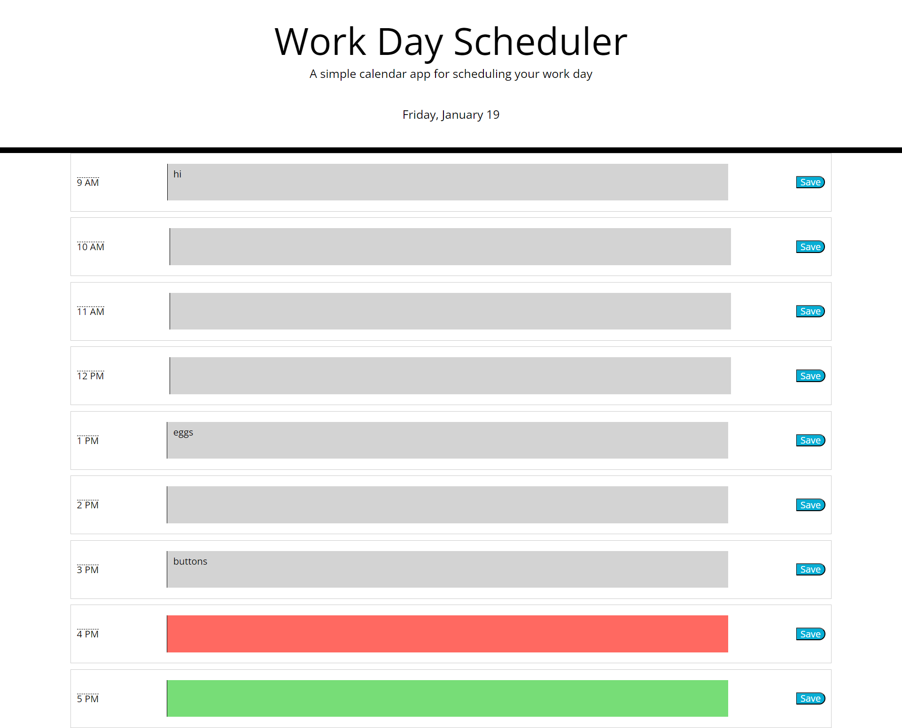

# Third-Party APIs: Work Day Scheduler

## Description
This Work Day Planner is a dynamic web application that assists users in organizing their work schedule effectively. Leveraging advanced JavaScript and jQuery, the app provides a user-friendly interface with dynamically updated HTML and CSS. It addresses the challenge of managing daily tasks during standard business hours.

## Project Structure

link to deployed application: https://sunsalio.github.io/c7-daily-planner-app/

## Usage
1. Open the Work Day Planner in your web browser.
2. Scroll down to view timeblocks for standard business hours.
3. Click on a timeblock to enter an event.
4. Click the "Save" button to save the entered event.
5. Events persist between page refreshes.

## Licensing
Daily Travel Planner operates under the [MIT License](LICENSE.md).